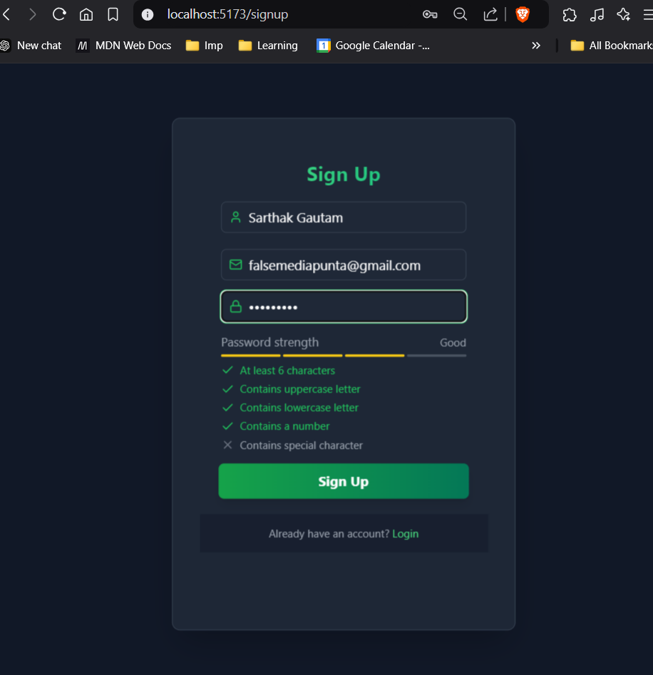
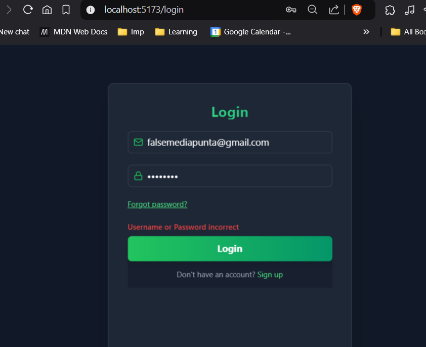
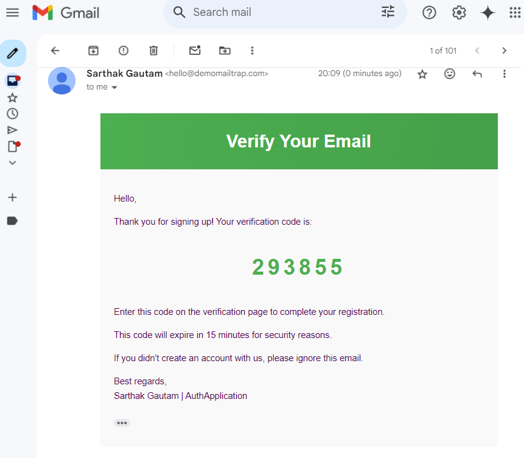
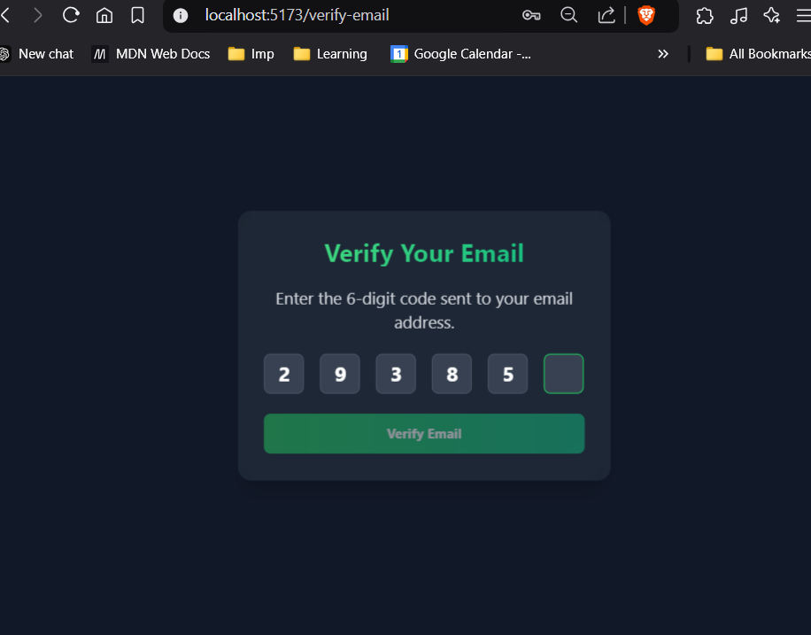
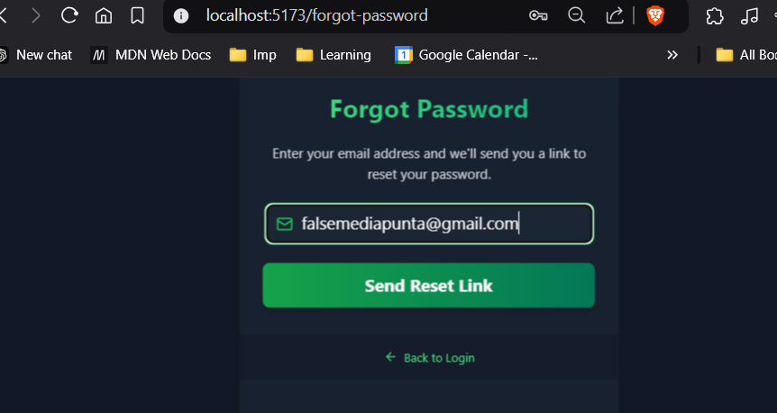
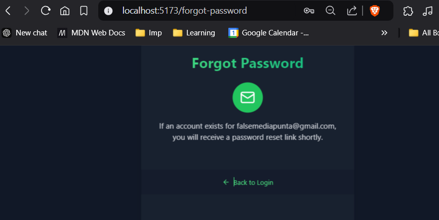
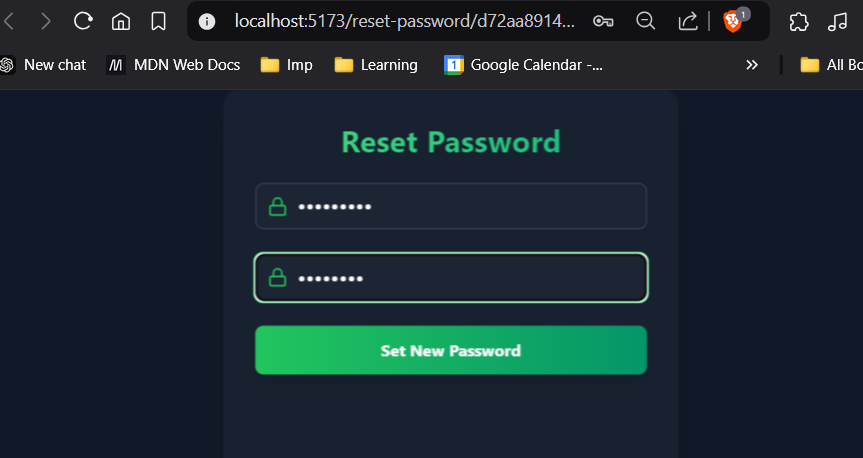
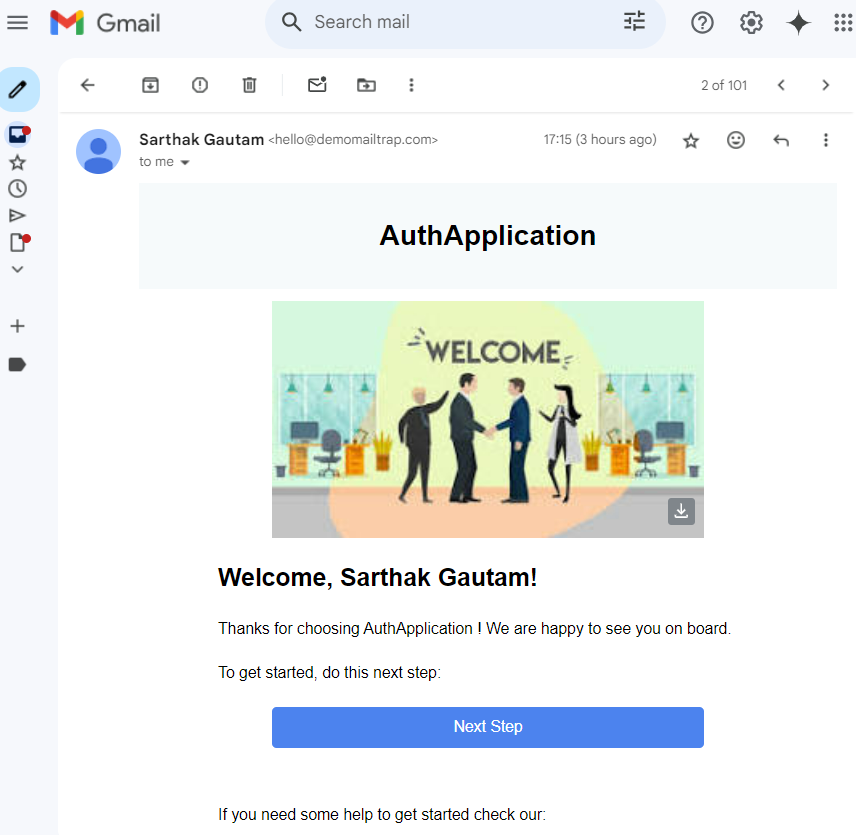
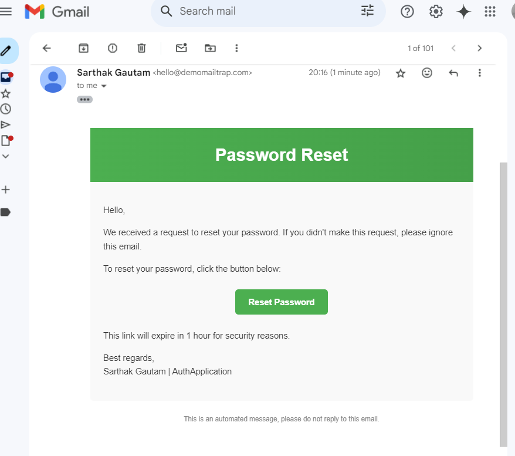
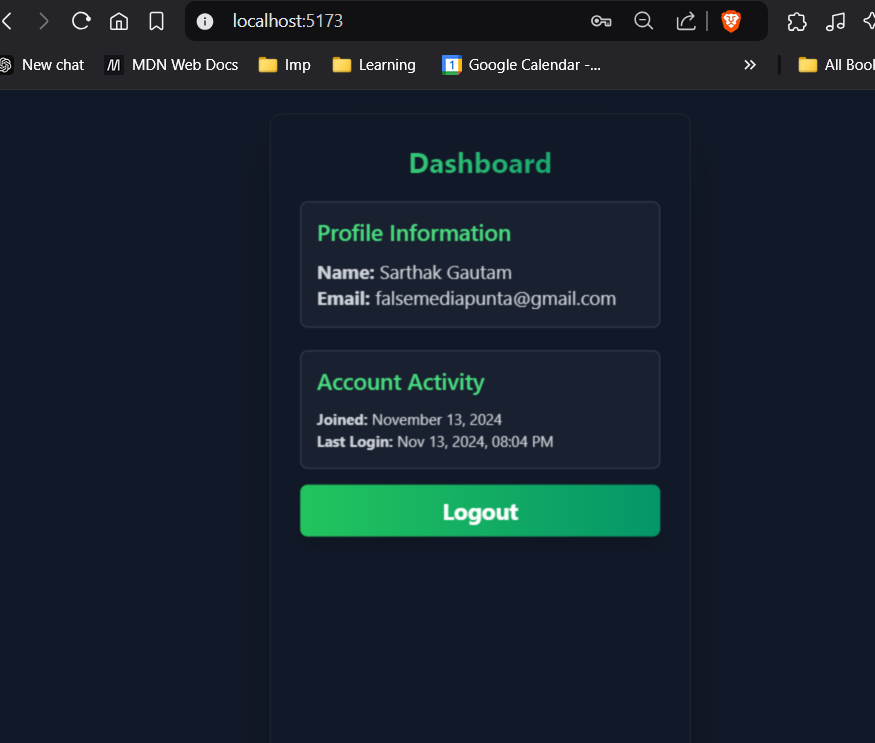

# AuthApplication - Advanced Authentication Project

This AuthApplication project is a robust backend authentication system with enhanced security features and efficient frontend integration. It covers the essential aspects of user authentication, including signup, login, email verification, password recovery, and route protection.

## Features

- **User Signup and Login**:  
Basic registration and login functionality with secure password handling.




- **Email Verification**:  
Verify user accounts through email verification codes.



- **Password Recovery**:  
Secure password recovery flow for resetting forgotten passwords.






- **Email Notifications**:  
  
Send verification, welcome, and password reset emails.




- **Protected Routes**:    
Route protection using JWT-based authentication, ensuring secure access to specific parts of the application.


## Tech Stack

- **Frontend**: React, Tailwind CSS
- **Backend**: Node.js, Express
- **Database**: MongoDB
- **Authentication**: JWT (JSON Web Token)

## Packages Used

```bash
npm install express cookie-parser mailtrap bcryptjs dotenv jsonwebtoken mongoose crypto
```

See [aboutPackages.md](./notes/aboutPackages.md) for a detailed explanation of each package.

## Project Setup

### Backend Setup

1. **Clone the repository** and install dependencies:

    ```bash
    git clone https://github.com/imSarthakGautam/Advanced_Authentication_System_MERN.git
    cd backend
    npm install
    ```

2. **Environment Variables**: Set up a `.env` file in the root directory with the following environment variables: See `.env.example`

3. **Run the Server**:

    ```bash
    npm start
    ```

### Frontend Setup

1. **Create a Vite React Project**:

    ```bash
    npm create vite@latest
    cd frontend
    npm install
    ```

2. **Install Tailwind CSS** and configure the `tailwind.config.js` file:

    ```bash
    npm install -D tailwindcss postcss autoprefixer
    npx tailwindcss init -p
    ```

3. **React Router**: Install `react-router-dom` for easy page navigation and dynamic routing.

    ```bash
    npm install react-router-dom
    ```

4. **Framer Motion**: Add interactive animations for a smoother user experience.

    ```bash
    npm install framer-motion
    ```

5. **Additional Libraries**:

    ```bash
    npm install zustand axios react-hot-toast lucide-react
    ```

## Key Project Components

### Authentication System

- **JWT Authentication**: Secures backend routes using JWTs, creating a secure token-based flow for user sessions.
- **Email Verification**: Users must verify their email before accessing protected routes. A verification code is sent via email, and users confirm it to complete registration.
- **Password Reset**: A reset token is emailed to users, allowing them to reset their password securely.

### Email Integration with Mailtrap

- We use [Mailtrap](https://mailtrap.io/) to handle email sending in development, including sending verification and password recovery emails.
  

## Frontend Libraries

- **Tailwind CSS**: For rapid and responsive UI design.
- **Zustand**: State management simplified for managing authentication status and user data.
- **React Router**: Streamlined navigation without reloading, making a single-page app feel seamless.

## Notes:

- [Handling Password Reset and Email Verification](./notes/handling_Password_reset%20_and_email_verification.md)
- [Sending Emails via Mailtrap](./notes/sending_emails_via_Mailtrap.md)


## Sample API Endpoints

### Auth Endpoints

| Endpoint              | Method | Protected | Description                                    |
|-----------------------|--------|-----------|------------------------------------------------|
| `/check-auth`         | GET    | Yes       | Checks if user is authenticated                |
| `/signup`             | POST   | No        | User signup                                    |
| `/login`              | POST   | No        | User login                                     |
| `/logout`             | POST   | Yes       | Logs out the user and clears session data      |
| `/verify-email`       | POST   | No        | Verifies user’s email                          |
| `/forgot-password`    | POST   | No        | Initiates password recovery process            |
| `/reset-password/:token` | POST | No       | Resets password using the provided token       |

---

This table summarizes each endpoint, the HTTP method, whether it’s a protected route, and a brief description of its purpose. Let me know if you need further customization!

## Run the Application

1. **Start the Backend Server**:

    ```bash
    cd backend
    npm start
    ```

2. **Start the Frontend Server**:

    ```bash
    cd frontend
    npm run dev
    ```
